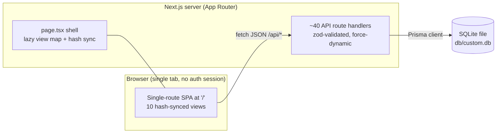

# Architecture

A contributor's tour of Circuit Retail ERP: how the pieces fit, the conventions that keep them consistent, and where to extend next.

## High-level system

A single-process monolith with zero external services: one Next.js server, one SQLite file.



- **One process.** UI, API routes, and the Prisma client ship in the same Next.js standalone server. No queue, no cache, no separate database server.
- **One file.** All state lives in `db/custom.db` (SQLite via Prisma 6). That file is the single source of truth — which is what makes `VACUUM INTO` backups and file-copy restores sufficient.
- **Printable surfaces.** Receipts, GRNs, labels, valuation, P&L and shift reports are rendered in-app and printed via the browser.

## Why a hash-router SPA on one route?

The app serves exactly one HTML route (`/`) and switches between 10 views by synchronizing the view key with the URL hash (`#/pos`, `#/sales`, …):

- **Simple deploys** — no per-route server rendering concerns; the standalone build serves everything from one process.
- **No server-side sessions** — the app is unauthenticated by design; hash navigation keeps the client fully in charge.
- **Refresh/back/forward resilience** — `page.tsx` mirrors `view ↔ location.hash` both directions (with a loop guard), so a reload or a shared link lands on the same view.
- **Views are lazy-loaded** (`React.lazy` map) behind a Suspense skeleton, so each view is its own chunk.

## Module map

`src/components/views/` holds the 10 feature views plus per-view sub-components; `src/components/app/` is the shell; `src/components/shared/` and `ui/` are the design system.

| Area | Components (key files) |
| --- | --- |
| Shell (`app/`) | `app-header` (live Dhaka clock, theme toggle, notification bell), `app-sidebar`, `app-footer`, `nav-list`, `command-palette`, `notification-bell`, `view-skeleton` |
| POS (`pos/`, `sales/`) | `pos/shift-bar`, `pos/shift-open-dialog`, `pos/shift-close-dialog`, `pos/shift-guard-dialog`; `sales/cart-panel`, `sales/checkout-dialog` (checkout UI lives under `sales/` and is shared by POS), `sales/receipt` (thermal print + 28px line thumbnails) |
| Sales (`sales/`) | `sale-detail` (32px thumbnails), `x-report`, `z-report`, `shift-history` (persisted snapshots + reprint) |
| Dashboard (`dashboard/`) | `dashboard-kpis`, `dashboard-charts`, `dashboard-lists`, `cash-drawer-card`, `shift-strip` (30s poll, only while a shift is open) |
| Products (`products/`) | `product-dialog`, `product-detail-drawer`, `image-picker` (canvas compression), `import-dialog`, `label-sheet` + `bulk-label-sheet` (12-up print), `barcode39` |
| Inventory (`inventory/`) | `purchase-orders`, `receive-dialog` + `grn-print`, `stocktake-dialog`, `adjust-dialog`, `valuation-print`, `cover-badge`, `movement-type` |
| Expenses (`expenses/`) | `expense-dialog`, `category-dialog`, `templates-dialog`, `attachment-thumb`, `month-range` |
| Customers (`customers/`) | `customer-dialog`, `aging-dialog`, `history-dialog` |
| Suppliers (`suppliers/`) | `supplier-dialog`, `statement-dialog` |
| Reports (`reports/`) | `reports-controls`, `reports-tables`, `reports-pnl`, `pnl-print` |
| Settings (`settings/`) | `profile-form`, `data-card` (JSON backup, CSV tools, demo reseed) |
| Shared (`shared/`) | `stat-card`, `page-bits`, `confirm-dialog`, `product-avatar` |

## Key subsystems

### Money & time conventions

- **Money** is always rounded to 2 decimals through the shared `round2` helper (`src/lib/api-utils.ts`); the sale pipeline (subtotal → discounts → tax → total → paid/change → profit) applies it consistently server-side, and the client mirrors it with an `r2` helper so previews match persisted values.
- **Time**: every "day" is a Dhaka (UTC+6) day regardless of the server's timezone. `src/lib/format.ts` exposes `startOfTodayUTC()`, `addDaysUTC()`, and `dayKeyToUTCStart/End()` which convert `YYYY-MM-DD` day keys into absolute UTC windows. API list/report endpoints take day-key `from`/`to` params and translate them through these helpers.

### Shift lifecycle (state machine)

```text
(none) ──POST /api/shifts {openingFloat, openedBy}──▶ OPEN
   ▲                                                    │
   │            GET /api/shifts/current (live totals)   │
   └──── 409 on double-open ◀─── second open attempt ────┘
                                                        │
                          POST /api/shifts/[id]/close {countedCash}
                                                        ▼
                                                      CLOSED
              totalsJson = {totals, expensesPaid, variance, closedAt}
                     variance = countedCash − expectedDrawer
```

- One open shift at a time (server-enforced, 409). `expectedDrawer = openingFloat + cashSales − cashRefunds` over the window; cash-method **expenses are reported (`expensesPaid`) but not deducted** — a deliberate policy footnoted in the close dialog.
- Close persists a `ShiftSnapshot` JSON into `Shift.totalsJson` in the same update as `closedAt`, so history and reprints render frozen numbers even if later refunds happen.
- The POS shift chip and dashboard strip poll `GET /api/shifts/current` (30s); the sales view's shift-history dialog reads `GET /api/shifts?limit=` (≤50) and parses snapshots client-side.

### POS checkout guard

Every checkout trigger (desktop Charge, mobile cart-sheet Charge, F9) funnels into one `attemptCheckout()` that issues a **fresh** `GET /api/shifts/current` per click — no polling needed. No open shift → amber guard dialog ("Start shift"); opening the shift auto-resumes the interrupted checkout (120ms dialog hand-off) if the cart still has items. **Fail-open philosophy**: if the status fetch itself errors, checkout proceeds — a soft process guard must never block a sale.

### Image pipeline

No server file storage. Images are compressed **client-side**: drop/pick a file → canvas resize (max 640px) → JPEG re-encode (quality ladder, starts q0.82) until the data URI fits the server's 300,000-character cap → stored on `Product.imageUrl`. At sale time the server snapshots `product.imageUrl` into each `SaleItem.imageUrl` (server-side, inside the transaction), so receipts and sale details keep the image as it was when sold.

### Printing architecture

All print surfaces use one pattern: the live DOM stays untouched; a hidden print clone is portalled to `document.body`; printing sets a `printing-*` class on `<body>` (e.g. `printing-receipt`, `printing-label`, `printing-bulk-labels`, `printing-shift`), and the `@media print` blocks in `globals.css` hide app chrome and show only the matching clone. Thermal-style rules (white paper, black text, grayscale thumbnails) live in the same CSS. This is why GRN, valuation, P&L and shift-report prints need no browser dialogs or server PDF rendering.

### Notification center & polling

`GET /api/notifications` runs four parallel Prisma queries over the Dhaka day window and returns low-stock (≤8, ratio-sorted), out-of-stock (≤8), the open shift, today's totals, and today's refund count. The header bell polls it every **60s** (plus a refetch on open) and renders severity-tinted deep-link rows; the dashboard shift strip polls `GET /api/shifts/current` every **30s** and renders nothing when no shift is open.

### State layer

- **Zustand** owns client UI state: `src/store/ui.ts` (active view + hash sync, sidebar, cached store settings) and `src/store/pos.ts` (cart, discounts, held carts).
- **TanStack Query** (via the `useApi` hook) owns server state with declarative `pollMs` polling; mutations go through `useMutation` + toast feedback (sonner).
- **react-hook-form + zod** for all forms; the same zod shapes guard the API routes.

## Data model

14 Prisma models (`prisma/schema.prisma`, SQLite):

- **`Category`** — product taxonomy (name, color chip).
- **`Supplier`** — vendor directory; linked to products and purchase orders.
- **`Product`** — SKU/barcode, name, unit, pricing (`costPrice`, `price`, `taxRate`), live `stock`, `reorderLevel`, soft-delete via `isActive`.
- **`StockMovement`** — immutable ledger: signed qty with before/after stock, type (`PURCHASE | SALE | ADJUST | DAMAGE | RETURN | REFUND`), reference. Every stock change writes a row inside the same transaction.
- **`Customer`** — contact info plus optional `creditLimit`; dues derive from sales.
- **`Sale`** — invoice header: unique `invoiceNo` (`INV-YYYYMMDD-####`), totals, `paid`/`change`, payment method, `COMPLETED | REFUNDED`, snapshot COGS/profit.
- **`SaleItem`** — per-line snapshot at sale time: name, SKU, unit price, cost, image URL; the product relation is `SetNull` so history survives product deletion.
- **`PurchaseOrder`** — `DRAFT | ORDERED | RECEIVED | CANCELLED` header with `poNo`.
- **`PurchaseOrderItem`** — PO line with `receivedQty` tracking across partial deliveries.
- **`ExpenseCategory`** — expense taxonomy with color.
- **`ExpenseTemplate`** — reusable blueprint (title, category, amount, method, frequency); posting creates a real `Expense` for today.
- **`Expense`** — expense record with optional receipt attachment (URL or compressed data URI).
- **`Settings`** — single row (`id = "main"`): store profile, currency (৳ BDT), default tax rate, receipt footer, `lowStockDays`.
- **`Shift`** — cashier shift: `openedAt/closedAt`, `openingFloat`, `countedCash`, `totalsJson` close snapshot, free-text `openedBy` (no auth yet).

## API conventions

- **Route handlers only** — no server actions. Every handler exports `dynamic = "force-dynamic"`; nothing is cached.
- **zod validation** on all mutating inputs, with friendly error JSON from the `bad()`/`zodMsg()` helpers in `src/lib/api-utils.ts`.
- **Shared helpers** — `round2` for money, day-key range utilities for Dhaka windows, `numParam` for query parsing, unique-constraint (P2002) mapping.
- **Snapshots over joins** — history-bearing rows (`SaleItem`, PO items) copy name/SKU/price/cost/image at write time, so old documents never change when master data changes.
- **Transactional writes** — sale creation (invoice sequence, stock decrement, ledger rows) and refund (stock restore, ledger rows) run in `$transaction`.
- **Discoverability** — `GET /api` returns the machine-readable endpoint index; `GET /api/health` is the probe used by uptime monitors and the compose healthcheck.

## Extension points

The roadmap items map cleanly onto existing shapes:

- **Multi-user auth** — replace free-text `Shift.openedBy` with a `users` table and a session layer; guard `/api` writes behind it. The UI already carries the cashier identity through the shift flow.
- **Server-side multipart uploads** — swap the client data-URI pipeline for `FormData` uploads to a route handler that stores files (and keep the `SaleItem.imageUrl` snapshot semantics unchanged).
- **Shift-aware sales filtering** — `GET /api/sales` already takes `from`/`to` day keys; adding `shiftId` window filters (using the shift's absolute open/close window) needs no schema change.
- **Notification preferences** — persist mute/steer settings (e.g. in `Settings` or a new model) and filter `/api/notifications` server-side; the bell already renders whatever the API returns.
- **Server-side stocktake sessions** — `POST /api/stock/stocktake` is currently one-shot; persist in-progress counts in a session row, then reuse the same movement-writing finish step.

## Performance & limits

Deliberate caps, chosen so a single-shop SQLite deployment stays fast and predictable:

| Limit | Value | Rationale |
| --- | --- | --- |
| Notification list rows | ≤8 per section | Keeps the bell popover light and the 60s poll cheap; badge caps at "9+". |
| Shift history | ≤50 rows (default 20) | History dialog renders one page; API clamps. |
| Product/expense image data URIs | ≤300,000 chars (~300KB) | Stored inline in SQLite; keeps rows, backups and receipts manageable. |
| Dashboard low-stock list | ≤12 | Fixed panel size. |
| Daily report range | ≤366 days | Zero-filled day rows are computed in JS; a year is the useful planning horizon. |
| List endpoints | `limit`/`offset` pagination | Prevents unbounded payloads; summaries are computed over the whole filtered set. |
